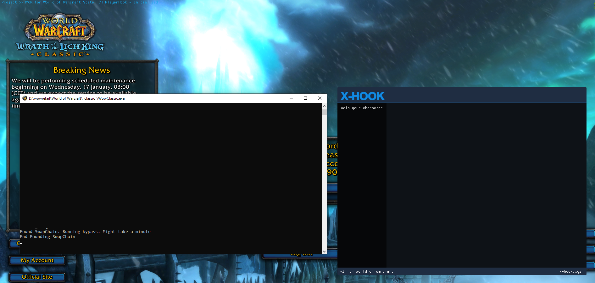

This folder contains the free version of my app.
You can use any injector as you like. The .dll contains a few asm bypasses to avoid warden bans. 

Keep in mind that this can cause your account to be banned use at your own risk. 

Versions supported:
Wrath classic 3.4.3.52237 and newer.
Upcomming (Requires some modifications to the player struct code):
WoW classic ~not yet~
SOM ~not yet~
RETAIL ~not yet~
